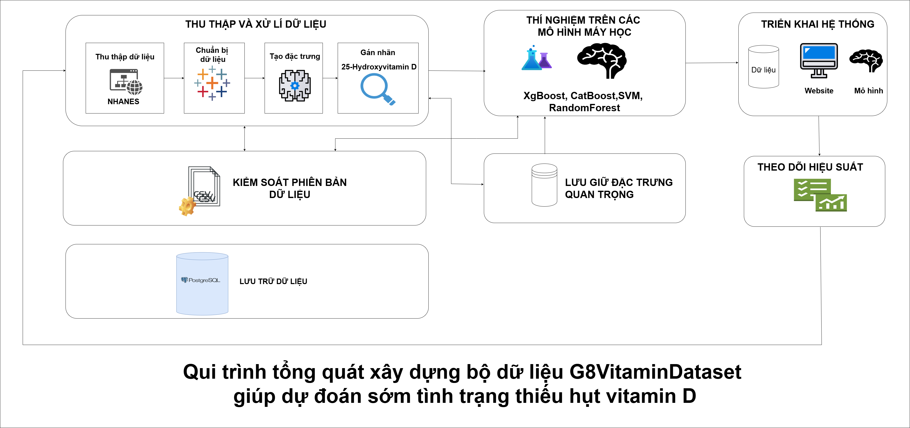

# 🧠 G8Vitamin
## 👨‍🏫 Lecture

| Name            | Role           | Affiliation              |
|-----------------|----------------|---------------------------|
| PhD.Nguyen Gia Tuan Anh  | Lecturer | Department of Information Science and Enginneering, University of Information Technology, HCM VNU |
| BS. Tran Quoc Khanh  | Teaching Assistant | Department of Information Science and Enginneering, University of Information Technology, HCM VNU |
## 👥 Project Members

| Name            | Role                | ID         |
|-----------------|---------------------|------------|
| Nguyen Vo Tien Loc    | Team Leader         | 22520792   |
| Pham Van Duy      | Member      | 22520341   |
| Truong Hoai Bao        | Member   | 22520126   |

## 📌 Overview
This project is aimed to help early predict vitamin D deficiency patients based on general report metrics and relavation demographics information.


---

## 📁 Folder Structure
```
G8Vitamin/
│
├── media/                  # image for readme
├── docs/                   # document location
├── data/
│   ├── raw/                # Original, immutable data
│   ├── processed/          # Cleaned data
│   └── final/              # Data for trainning
│
├── notebooks/              # Jupyter notebooks for exploration and prototyping
│
├── src/                    # Source code
│   ├── crawl/              # Scripts for crawling data
│   ├── integration/        # Integration data
│   ├── models/             # Training, evaluation, saving models
│
├── models/                 # Trained and serialized models
│
├── outputs/                # Logs, reports, figures
│
├── requirements.txt        # Python dependencies
├── setup.py                # Project installation script (if packaging)
├── .gitignore              # Files to ignore in version control
└── README.md               # Project overview and instructions
```

### 📦 Installation and Setup
```bash
git clone https://github.com/iseT1enLoc/G8Vitamin.git
cd G8Vitamin
```
## 🤝 Acknowledgements
- [NHANES](https://wwwn.cdc.gov/)
- [Scikit-learn](https://scikit-learn.org/)
- [PyTorch](https://pytorch.org/) or [TensorFlow](https://www.tensorflow.org/)
## 📬 Contact

For any questions or inquiries, feel free to contact us:

- **Team Representative:** Nguyen Vo Tien Loc 
  📧 Email: locnvt.it@gmail.com
  📱 Phone: +84 398541346


